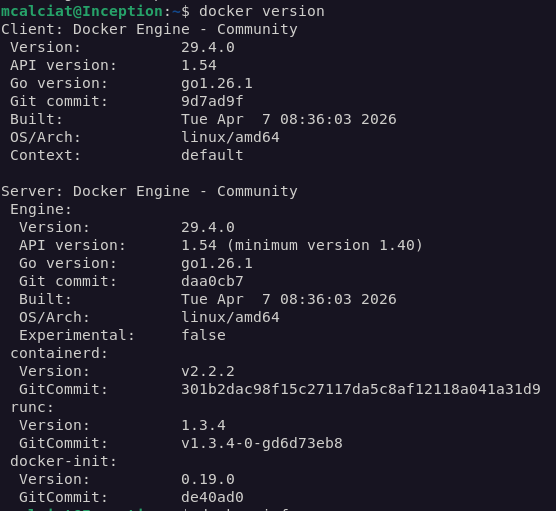
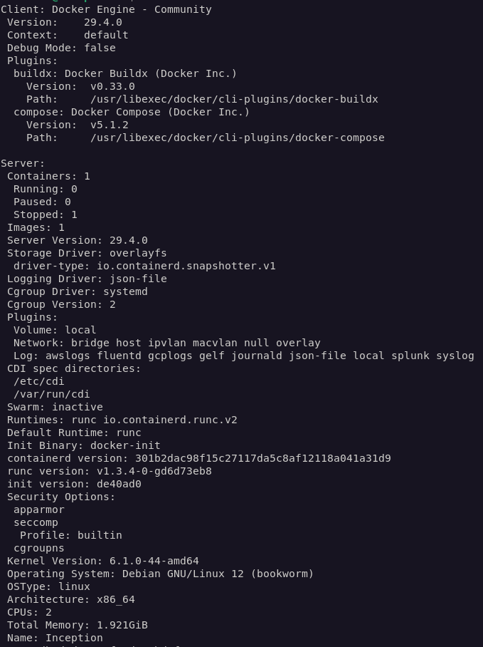
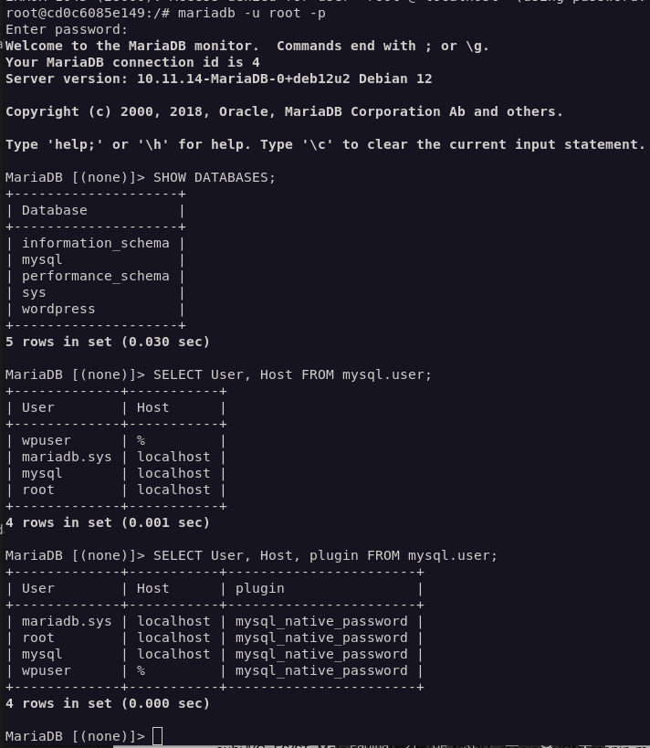

# General Workflow 

## 🪜 STEP 0 — Prepare environment

### A. Install a Virtual Machine (VM)

1. download Debian 12.9
https://cdimage.debian.org/cdimage/archive/12.9.0/amd64/iso-cd/
https://cdimage.debian.org/cdimage/archive/12.9.0/amd64/iso-cd/debian-12.9.0-amd64-netinst.iso

2. open Virtual Box, create a NEW virtual machine.
user: mcalciat
pwd: inception42
ram size: 2 GB
processirs: 2 CPU
Disk size: 20 GB

3. Go to Settings > Network and change NAT to Bridged Adapter. You will need to to setup an SSH connection.

4. Once in the VM, check sudo is installed:  
* apt install sudo (if not installed). Insert the same password you choose when installing the VM when asked.
* in a terminal, add your user to sudo: `usermod -aG sudo <your_user>`
    * this way you can execute admin commands without being in "sudo"
    * check: `sudo whoami` (shoudl reply "root")


### B. Set up OpenSSH to comunicate your PC and your VM

- OpenSSH server → runs inside your VM  
- OpenSSH client → runs on your local machine  

👉 This lets you:  
* Connect to your VM terminal remotely  
* Copy files between machines  
* Automate workflows  

In the VM, install OpenSSH and check if it is running:
```bash
sudo apt update
sudo apt install openssh-server -y
sudo systemctl status ssh
```

If it is **NOT** running:
```bash
sudo systemctl start ssh
sudo systemctl enable ssh
```

Find out, the VM's ip
```bash
ip a
```
You should see 192.168.x.x 

From the host PC
```bash
ssh <your_user>@<VM_ip>
```
for example
```bash
ssh maria@192.128.2.5
```

First time it will ask to confirm `yes`, and then to re-type the VM `password`.

4. Install curl  
`curl` is a tool to download data from the internet via terminal.  

Debian’s default repositories may have older Docker versions. This project expects a proper, up-to-date Docker setup: download `Docker’s official GPG key`.  

> “Only trust packages from Docker if they are signed with this official key”.  
> This verifies the packages are authentic (not tampered).  
> Without a GPG key, anyone could fake a package and make an user install malware instead of Docker.  

After installing curl, create a directory where the system will store trusted GPG keys (like Docker’s key).
Download the Dockers public signing key, and convert it into a format usable by APT and save it.

**Run**: 
```bash
sudo apt install curl -y

sudo mkdir -p /etc/apt/keyrings

curl -fsSL https://download.docker.com/linux/debian/gpg | sudo gpg --dearmor -o /etc/apt/keyrings/docker.gpg
```

5. Add Docker's official repository to the system

**Run:**
```
echo "deb [arch=$(dpkg --print-architecture) signed-by=/etc/apt/keyrings/docker.gpg] https://download.docker.com/linux/debian $(lsb_release -cs) stable" | sudo tee /etc/apt/sources.list.d/docker.list > /dev/null
```

---

### B. Install Docker + Docker Compose  

🚀 **Step 1 — Install Docker**  
```bash
sudo apt update && sudo apt install -y docker-ce docker-ce-cli containerd.io docker-compose-plugin
```
**What is this installing?**  
| Package                 | Role                                 |
| ----------------------- | ------------------------------------ |
| `docker-ce`             | Main Docker engine                   |
| `docker-ce-cli`         | Command-line interface (`docker`)    |
| `containerd.io`         | Container runtime (low-level engine) |
| `docker-compose-plugin` | Enables `docker compose`             |

⚙️ **Step 2 — Start Docker service**
```bash
sudo systemctl start docker
```
This starts the Docker daemon (the “engine” running in background)


👉 *Optional but recommended*
```bash
sudo systemctl enable docker
```
*This makes Docker start automatically on boot*


🧪 **Step 3 — Test installation**
* Check version  ---> Docker CLI is installed and working
```bash
docker --version
```

* check Docker's info 
```bash 
docker info
```



* Hello world Test ---> Docker daemon is working and containers run correctly
```bash
sudo docker run hello-world
```
Now:
* Docker pulls a tiny test image
* Runs it in a container
* Prints a success message


🚨🚨 If there is a permissions error in the version or info test:
```
sudo usermod -aG docker $USER
```
and `exit` ssh connection, and `restart` the VM.

---

## 🪜 STEP 1 — Project structure

Create:
```
Makefile  
srcs/
  docker-compose.yml
  .env
  requirements/
    nginx/
    wordpress/
    mariadb/
```
**Use:**
```bash
mkdir -p ~/Inception/srcs
mkdir -p ~/Inception/srcs/requirements/mariadb/{conf,tools}
mkdir -p ~/Inception/srcs/requirements/nginx/{conf,tools}
mkdir -p ~/Inception/srcs/requirements/wordpress/{conf,tools}
mkdir -p ~/Inception/srcs/requirements/tools
touch ~/Inception/Makefile
touch ~/Inception/srcs/docker-compose.yml
touch ~/Inception/srcs/.env
```

Then check it:
```bash
tree ~/Inception
# or, if tree is not installed:
find ~/Inception -type d -o -type f | sort
```

Because the subject says the named volumes must store data inside: `/home/login/data`, create them:

```bash
mkdir -p /home/mcalciat/data/mysql
mkdir -p /home/mcalciat/data/wordpress
```

---

## 🪜 STEP 2 — Build MariaDB container
Recap on the subject’s mandatory rules:
```
[a] one dedicated container for MariaDB
[b] built from your own Dockerfile
[c] no ready-made MariaDB image
[d] database data persisted in a named volume
[e] credentials passed through environment variables, not hardcoded in Dockerfile
```

Create 3 files for MariaDB:
```bash
touch srcs/requirements/mariadb/Dockerfile
touch srcs/requirements/mariadb/conf/50-server.cnf
touch srcs/requirements/mariadb/tools/setup.sh
chmod +x srcs/requirements/mariadb/tools/setup.sh
```
1. Write Dockerfile
```bash
FROM debian:bookworm

RUN apt-get update && apt-get install -y mariadb-server && \
    apt-get clean && rm -rf /var/lib/apt/lists/*

COPY conf/50-server.cnf /etc/mysql/mariadb.conf.d/50-server.cnf
COPY tools/setup.sh /usr/local/bin/setup.sh

RUN chmod +x /usr/local/bin/setup.sh

EXPOSE 3306

ENTRYPOINT ["/usr/local/bin/setup.sh"]
```

2. Configure database
```bash
[mysqld]
bind-address = 0.0.0.0
port = 3306
datadir = /var/lib/mysql
socket = /run/mysqld/mysqld.sock
pid-file = /run/mysqld/mysqld.pid
```

`bind-address = 0.0.0.0` allows **MariaDB** to accept connections from the **WordPress** container through the Docker network.  
If it stayed only on localhost, WordPress would not be able to connect.  

3. Write startup script: add user + DB
Inside setup.sh there will a script in charge of launching, creating DB, sql user and password. The container keeps running with MariaDB as the main process.

```bash
#!/bin/bash
set -e

mkdir -p /run/mysqld
chown -R mysql:mysql /run/mysqld
chown -R mysql:mysql /var/lib/mysql

if [ ! -d "/var/lib/mysql/mysql" ]; then
    mariadb-install-db --user=mysql --datadir=/var/lib/mysql
fi

if [ ! -f "/var/lib/mysql/.setup_done" ]; then
    mariadbd --user=mysql --datadir=/var/lib/mysql --socket=/run/mysqld/mysqld.sock --pid-file=/run/mysqld/mysqld.pid --skip-networking &
    pid="$!"

    until mariadb --protocol=socket -u root -e "SELECT 1;" >/dev/null 2>&1; do
        sleep 1
    done

    mariadb --protocol=socket -u root << EOF
CREATE DATABASE IF NOT EXISTS \`${MYSQL_DATABASE}\`;
CREATE USER IF NOT EXISTS '${MYSQL_USER}'@'%' IDENTIFIED BY '${MYSQL_PASSWORD}';
GRANT ALL PRIVILEGES ON \`${MYSQL_DATABASE}\`.* TO '${MYSQL_USER}'@'%';
ALTER USER 'root'@'localhost' IDENTIFIED BY '${MYSQL_ROOT_PASSWORD}';
FLUSH PRIVILEGES;
EOF

    touch /var/lib/mysql/.setup_done

    mariadb-admin --protocol=socket -u root -p"${MYSQL_ROOT_PASSWORD}" shutdown
    wait "$pid"
fi

exec mariadbd --user=mysql --datadir=/var/lib/mysql --socket=/run/mysqld/mysqld.sock --pid-file=/run/mysqld/mysqld.pid
```
These lines: 
```bash
mkdir -p /run/mysqld
chown -R mysql:mysql /run/mysqld
chown -R mysql:mysql /var/lib/mysql
```
help avoid startup errors related to:
- missing socket directory  
- wrong ownership on DB files  
- MariaDB not being able to write its pid/socket

These lines: `/var/lib/mysql/.setup_done` will:
- first launch → create DB/user/passwords, then create marker
- next launches → skip setup safely

4. Include mariadb's setup script variables in `.env`
MariaDB's setup.sh script expects the definition of those variables it uses.   
These needs to placed in `.env` when we wire MariaDB into `docker-compose.yml`.
Fill `.env` with these lines:
```bash
MYSQL_DATABASE=wordpress
MYSQL_USER=wpuser
MYSQL_PASSWORD=wp_pass_42
MYSQL_ROOT_PASSWORD=root_pass_42

MYSQL_VOLUME=/home/mcalciat/data/mysql
WP_VOLUME=/home/mcalciat/data/wordpress
DOMAIN_NAME=mcalciat.42.fr
```

Remember this : 
> MYSQL_ROOT_PASSWORD=root_pass_42

5. Write mariadb's docker compose info 
Open the file
```bash
vim ~/Inception/srcs/docker-compose.yml
```
Include mariaDB verision:
```yaml
services:
  mariadb:
    container_name: mariadb
    build: ./requirements/mariadb
    image: mariadb
    env_file:
      - .env
    volumes:
      - mariadb_data:/var/lib/mysql
    networks:
      - inception
    restart: always

volumes:
  mariadb_data:
    driver: local
    driver_opts:
      type: none
      o: bind
      device: ${MYSQL_VOLUME}

networks:
  inception:
    driver: bridge
```

This will **build the image** from the Dockerfile, **name the image mariadb** (which matches the service name), **load the .env** variables, **mounts the named volume** int mysql (where the data is stored). In case of crash, there are **instruction to restart**. 
It also creates the `Docker network` that will connect mariadb to `WordPress` and `NGINX`.

6. Test mariadb
Use:
```bash
cd ~/Inception/srcs
docker compose up --build
```
On first launch, MariaDB should:
- build the image  
- initialize the DB  
- create the database  
- create the SQL user  
- stay running

If you want to stop it, use:
```bash
docker compose down
```
If you want to stop and remove volumes too:
```bash
docker compose down -v
```
🚨🚨 Be careful:`-v` deletes persisted DB data.🚨🚨

If asked `Watch` versus `Detach`, recommendation is `detach`, and it will run in the background. Choosing watch means you'll be watching logs in real time. The terminal is "blocked". That is useful only for debugging.

In another terminal, do:
```bash
# to see it running
docker ps
# to see logs
docker compose logs mariadb
```

7. Database validation
Seeing logs prove the server is running, bit to actual confirm that the database was created, the SQL user was created and the root password was applied, do as follows:
```bash
docker exec -it mariadb bash
```
Then inside the container
```
mariadb -u root -p
```
Enter the root password from `.env`

Then run:
```bash
SHOW DATABASES;
# check the custom database exists
SELECT User, Host FROM mysql.user;
# checks the custom user exists
SELECT User, Host, plugin FROM mysql.user;
# shows how each user authenticates to MariaDB
```


To exit, just type `exit` twice.

`plugin` check is done to verify that MariaDB users use **password-based authentication (mysql_native_password) instead of socket-based authentication**, which would prevent WordPress from connecting through the Docker network.

```bash
root   | localhost | mysql_native_password
wpuser | %         | mysql_native_password
```
- root uses password → OK ✅  
- wpuser uses password → OK ✅  
- wpuser can connect from anywhere → OK ✅  

8. Exit Maria DB  
⛔️ To **exit** MariaDB, just type `exit` twice.   
Once to exit MariaDB itself, and 2nd time to exit root.

### 🧼 Reset & re-testing
If you need to `RE test` because you found an error, do a **full reset** because the current `MariaDB volume` already contains partially initialized data. It should be reseted before retesting, or the old state may remain. 
```bash
cd ~/Inception/srcs
docker compose down -v
sudo rm -rf /home/mcalciat/data/mysql
mkdir -p /home/mcalciat/data/mysql
```
 Then rebuild:
```
docker compose up --build
```

### 📯 Recap of Step-2
If all went well, MariaDB step is now working correctly:
* container runs         
* custom DB created      
* custom SQL user created 
* root configured         
* mariaDB files were created: Dockerfile, config, init script.
* docker compose file was created
* volumen mount and DB/user validation

Make a BACKUP copy of these files:
```bash
srcs/requirements/mariadb/Dockerfile
srcs/requirements/mariadb/conf/50-server.cnf
srcs/requirements/mariadb/tools/setup.sh
srcs/docker-compose.yml
srcs/.env
```

---

## 🪜 STEP 3 — Build WordPress container
Install:
* PHP  
* php-fpm  
* WordPress 
* Connect to MariaDB


---
🪜 STEP 4 — Build NGINX container
Configure HTTPS
Reverse proxy to WordPress
🪜 STEP 5 — Volumes
Create named volumes

Map to:

/home/<login>/data
🪜 STEP 6 — Docker Compose
Connect all containers
Define network
Define volumes


🪜 STEP 7 — Domain setup

Edit /etc/hosts:

127.0.0.1  yourlogin.42.fr
🪜 STEP 8 — Security & env
.env file
Docker secrets
🪜 STEP 9 — Testing

Open browser:

https://yourlogin.42.fr
🪜 STEP 10 — Documentation
README
USER_DOC
DEV_DOC