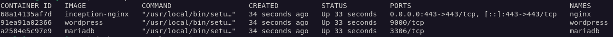

# DEVELOPER DOCUMENTATION

## 📌 Overview

This document explains how to set up, build, and manage the project from scratch.

The project is a Docker-based infrastructure composed of:

* NGINX
* WordPress (PHP-FPM)
* MariaDB
* Adminer (bonus)

---

## ⚙️ Prerequisites

* Debian-based system (Virtual Machine recommended)
* Docker and Docker Compose installed
* Sudo privileges
* `curl` installed.

---

## 🪜 Environment Setup

### Install Docker

```bash
sudo apt update && sudo apt install -y docker-ce docker-ce-cli containerd.io docker-compose-plugin
```
Start Docker service:
```bash 
sudo systemctl start docker
```

**Optional**: make Docker start automatically on boot.
```bash
sudo systemctl enable docker
```

Test Installation
```bash
#  Check version  ---> Docker CLI is installed and working
docker --version
# check Docker's info
docker info
# Hello world Test ---> Docker daemon is working and containers run correctly
sudo docker run hello-world
```

🚨🚨 If there is a permissions error in the version or info test:
```bash
sudo usermod -aG docker $USER
```
and `restart` the VM.

---

### Configure Docker data-root

The project requires Docker volumes to be stored under:

```bash
/home/<login>/data
```

To configure this:

```bash
sudo systemctl stop docker
sudo mkdir -p /home/<login>/data/docker
sudo vim /etc/docker/daemon.json
```

Add:

```json
{
  "data-root": "/home/<login>/data/docker"
}
```

Then restart Docker:

```bash
sudo systemctl daemon-reload
sudo systemctl start docker
```

Verify:

```bash
docker info | grep "Docker Root Dir"

# the expected output is :
Docker Root Dir: /home/<login>/data/docker
```

---

## 📁 Project Structure

```bash
.
├── Makefile
└── srcs/
    ├── docker-compose.yml
    ├── .env
    └── requirements/
        ├── mariadb/
        ├── nginx/
        ├── wordpress/
        └── bonus/
            └── adminer/
```

---

## 🚀 Build and Launch

From the project root:

```bash
make
```

This will:

* Build all Docker images
* Create containers
* Start services in the background

---

## 🧰 Container Management

### Check running containers

```bash
docker ps
```
You should see:

* nginx
* wordpress
* mariadb
* adminer 

---


### Stop containers

```bash
make down
```

---

### Restart containers

```bash
make restart
```

---

### Clean containers and volumes

```bash
make clean
```

---

### Full reset (⚠️ deletes all data)

```bash
make fclean
```

---

## 💾 Data Persistence

The project uses **Docker named volumes**:

* `mariadb_data` → database files
* `wordpress_data` → website files

These volumes are stored under:

```bash
/home/<login>/data/docker
```

This ensures:

* Data persists after container restart
* Data is isolated from the host filesystem
* Compliance with project requirements

---

## 🔍 Debugging & Verification


### View logs

```bash
cd srcs/
docker compose -f srcs/docker-compose.yml logs
```

### Check volumes

```bash
cd srcs/
docker volume ls
# check Mountpoint (Docker data root)
docker volume inspect mariadb_data
docker volume inspect wordpress_data
```

---

### MariaDB access

```bash
# see logs
cd srcs/
docker compose logs mariadb
# enter mariaDB container (will ask for ROOT password in .env file)
docker exec -it mariadb mariadb -u root -p
# once inside
SHOW DATABASES;
SELECT User, Host FROM mysql.user;
SELECT User, Host, plugin FROM mysql.user;
```

To exit the container type `exit`.
---

### WordPress container

```bash
# check logs
cd srcs/
docker compose logs wordpress
# sometimes there will be none and it is OK
```

---

### Network test

```bash
# test if WP can resolve the MariaDB container name
docker exec -it wordpress getent hosts mariadb
```

---

### NGINX

```bash
cd srcs/
docker compose logs nginx
```
You want to see something like:



You can check here that port 443 is the only one exposed. 

### Test website availability

```bash
curl -k https://<login>.42.fr
curl -k -I https://<login>.42.fr
```
`REPLACE <login> with the correct username!`

Expected result:

* HTTP response (200 OK or redirect)

```
HTTP/1.1 200 OK
Server: nginx/1.22.1
Date: Tue, 28 Apr 2026 09:41:33 GMT
Content-Type: text/html; charset=UTF-8
Connection: keep-alive
Link: <https://<login>.42.fr/index.php?rest_route=/>; rel="https://api.w.org/"
```
---

## ⚠️ Notes

* The `.env` file must be provided manually and must not be committed
* Only port **443** is exposed externally
* All services communicate through a Docker bridge network

---


