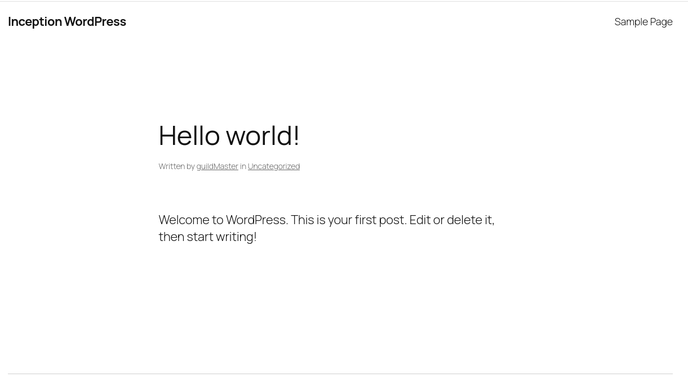
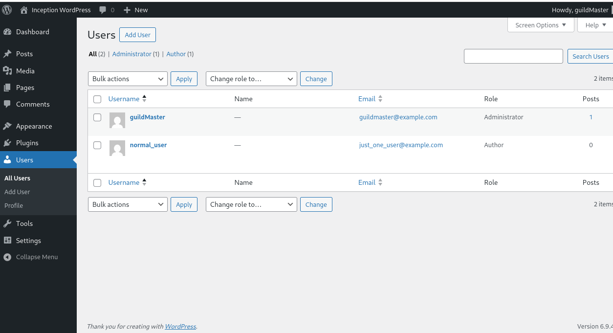

# USER DOCUMENTATION

## 📌 Overview

This project provides a complete web application stack composed of the following services:

* **NGINX** → Web server handling HTTPS connections (port 443)
* **WordPress** → Website and application interface
* **MariaDB** → Database used by WordPress
* **Adminer (bonus)** → Web interface for database management

All services run automatically inside Docker containers and communicate internally.

---

## 🚀 Starting and Stopping the Project

### Start the project

```bash
# In Inception/
make
```

This command:

* Builds the containers (if needed)
* Starts all services in the background

---

### Stop the project

```bash
make down
```
* Stops and removes the running containers.

---

### Restart the project
```bash
make start
```
Starts containers without rebuilding (to be used after `make down`).

```bash
make restart
```
= `make down && make start`

---

### Partial reset
```bash
make clean
```
* stops containers + removes volumes.  
* It does NOT delete /home/<username>/data/* (data still exists).

### Full reset (⚠️ deletes all data)

```bash
make fclean
```
`FULL RESET`: removes containers + removes volumes + removes images + deletes ALL data folders (including hidden files!) + recreates empty directories.  

---

## 🌐 Accessing the Services

### Website (WordPress)

Open a browser and go to:

```text
https://<login>.42.fr
```

Example:

```text
https://mcalciat.42.fr
```

The WordPress “Hello World” website should appear. 

---

### WordPress Admin Panel

```text
https://<login>.42.fr/wp-admin
```

Use the administrator credentials defined in the `.env` file.  
The `.env` file is **NOT** included in the repository for safety reasons. The owner of the project will provide you with it.  
Use the administrator credentials defined in the .env file to access the dashboard. Verify that the users and the comment (if any were made) are still present.



As admin, you can approve the comment that was submitted. Then refresh the home site, and check if the comment is there. 

To test permanence of information, use `make restart` and/or `make clean` (NOT fclean or the information will be deleted). Once everything is up again, you can check the website again, and re-validate users are there, and the comment is there too. 

---

### Adminer (Database Interface)

This interface allows direct interaction with the database.  
Go to:
```text
https://<login>.42.fr/adminer/
```
The Adminer login page should be shown.  


Login with the .env credentials:  
```bash
System:   MySQL
Server:   mariadb
Username: --------------> (see .env file)
Password: --------------> (see .env file)
Database: wordpress
```

---

## 🔑 Credentials Management

All credentials are stored in the `.env` file located in:

```text
srcs/.env
```

This file contains:

* Database name
* Database user and password
* WordPress administrator credentials
* Additional user credentials

⚠️ Important:

* This file contains sensitive information
* It must NOT be shared or committed to a public repository

---

## ✅ Expected Behavior

* The website loads over **HTTPS only**
* The WordPress login page is accessible
* The admin user can log in successfully
* The database is reachable via Adminer
* Data (users, posts, comments) persists after restart

---

## ⚠️ Notes

* Only port **443 (HTTPS)** is exposed to the outside
* All other services are internal and not directly accessible
* A self-signed certificate is used, so the browser may show a warning ⚠️

---
